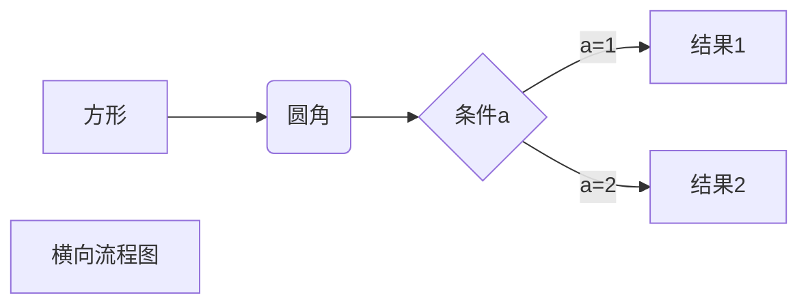

# Hi there 👋

## Make sure it’s public and initialize it with a README to get started.

- ☑ 摸鱼
- 🔜 To be continued

# readme
## esa
- sad *  
*ju***ju**___ju___
---
~~ju~~  
<u>带下划线文本</u>

创建脚注格式类似这样[^RUNOOB]。

[^RUNOOB]: bda  
1. dsa  
    - das  
    - as

[链接名称](链接地址)


> follow

    $(document).ready(function () {
    alert('RUNOOB');
    });

``` c
#include<stdio.h>
int main(){
    return0;
}
```
| 表头 | 表头 |
|  ----  | :----:  |
|  单元格  | 单元格 |
| 单元格  | 单元格 |
|sdfd|sdf|

$$
\mathbf{V}_1 \times \mathbf{V}_2 =  \begin{vmatrix} 
\mathbf{i} & \mathbf{j} & \mathbf{k} \\
\frac{\partial X}{\partial u} &  \frac{\partial Y}{\partial u} & 0 \\
\frac{\partial X}{\partial v} &  \frac{\partial Y}{\partial v} & 0 \\
\end{vmatrix}
${$tep1}{\style{visibility:hidden}{(x+1)(x+1)}}
$$



<!--
**DavidRicardoShen/DavidRicardoShen** is a ✨ _special_ ✨ repository because its `README.md` (this file) appears on your GitHub profile.

Here are some ideas to get you started:

- 🔭 I’m currently working on ...
- 🌱 I’m currently learning ...
- 👯 I’m looking to collaborate on ...
- 🤔 I’m looking for help with ...
- 💬 Ask me about ...
- 📫 How to reach me: ...
- 😄 Pronouns: ...
- ⚡ Fun fact: ...
-->
